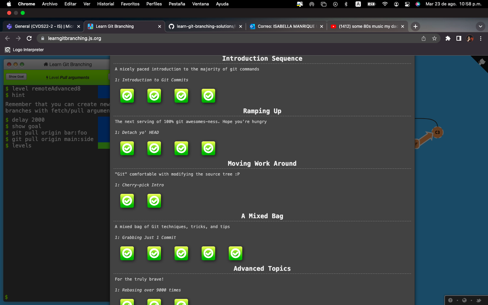
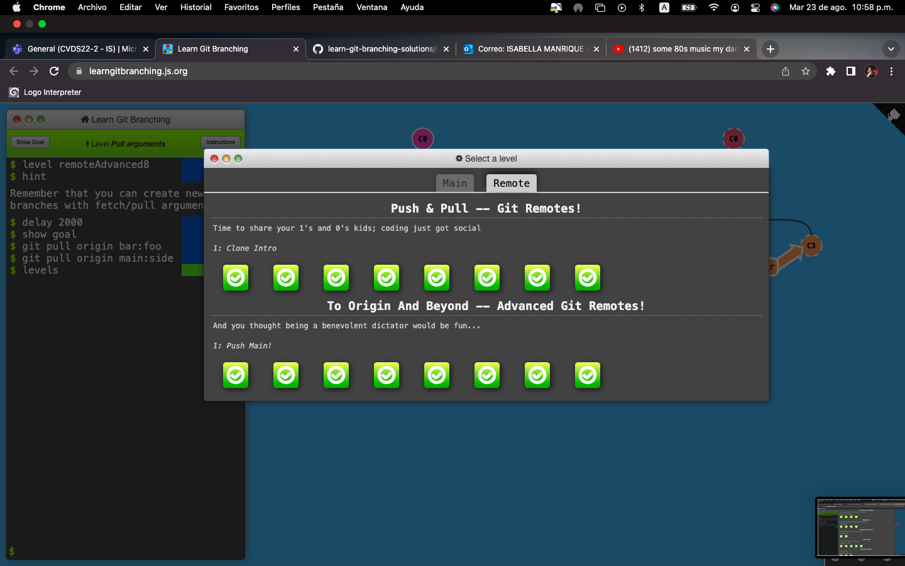

# Parte I
# Archivo en formato Markdown
## Datos básicos:
### Nombre:
_Isabella Manrique_
### Edad:

**20 años**

### Fecha de nacimiento:

23 de noviembre de 2001

### Comida favorita:

* Pasta
* Lasagna
* Pizza

### Canciones favoritas:

1. august, Taylor Swift
2. La Buena Vida, Camila Cabello
3. So Good, Halsey

### Carrera:
Ingenieria de Sistemas

### Video favorito:

<https://www.thisworldthesedays.com/greatest-places-to-visit-in-italy.html>

### Aqui estara una imagen:

### Aqui un fragmento de código

`print('Hello World')`

# Parte II

### Capturas de pantalla tutorial learning git branching
_Carné 2168729_
_Fecha: Martes 23 de Agosto de 2022_

